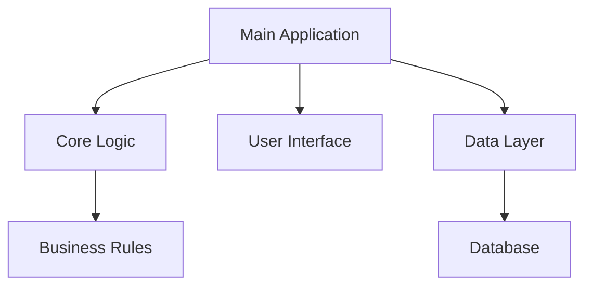
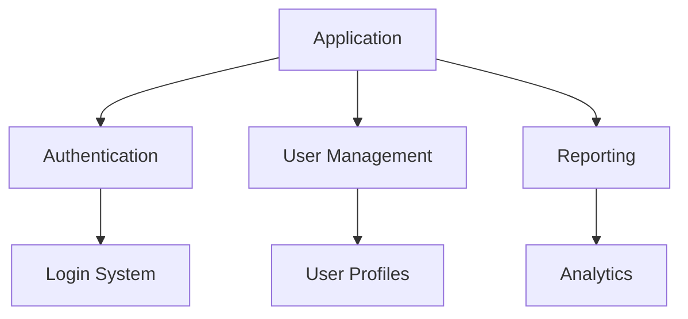

# Mermaid Diagram Generation

Generate a Mermaid diagram that visualizes the project structure and relationships based on the analyzed commit history and project memory.

## Diagram Types

Choose the most appropriate diagram type based on the project:

### Graph Diagram (graph TD)
- Best for showing **hierarchical relationships** and **dependencies**
- Use for **project structure** and **component relationships**
- Show **data flow** and **process flows**

### Flowchart (flowchart TD)  
- Best for showing **processes** and **decision flows**
- Use for **user workflows** and **system processes**
- Show **conditional logic** and **branching**

### Class Diagram (classDiagram)
- Best for **object-oriented projects**
- Show **class relationships** and **inheritance**
- Display **method signatures** and **properties**

## Content Guidelines

### Project Structure
- Show **main components** and **modules**
- Display **architectural layers** (UI, Business Logic, Data)
- Illustrate **key relationships** and **dependencies**

### Feature Mapping
- Include **major features** as distinct nodes
- Show **feature relationships** and **dependencies**
- Group **related functionality** together

### Technical Architecture
- Represent **technical stack** components
- Show **data flow** between components
- Include **external dependencies** and **integrations**

## Mermaid Syntax Guidelines

### Node Naming
- Use **clear, descriptive labels**
- Keep labels **concise** but **meaningful**
- Use **consistent naming** conventions

### Relationships
- Use appropriate **arrow types** for relationships
- **Label connections** when meaning isn't obvious
- Show **direction** of dependencies or data flow

### Styling
- Use **consistent colors** for similar components
- **Group related items** with subgraphs when appropriate
- Keep **visual hierarchy** clear

## Quality Standards

### Clarity
- Diagram should be **easily understandable**
- **Avoid cluttering** with too many details
- Focus on **high-level relationships**

### Accuracy
- Ensure diagram **reflects actual project structure**
- Base connections on **real dependencies** from code analysis
- **Validate** against commit history insights

### Usefulness
- Diagram should **help newcomers** understand the project
- **Highlight important** architectural decisions
- Show **areas of complexity** or **technical debt**

## Example Patterns

### Simple Project Structure

### Feature-Based Architecture

Focus on creating diagrams that provide **immediate value** for understanding the project's structure and evolution.